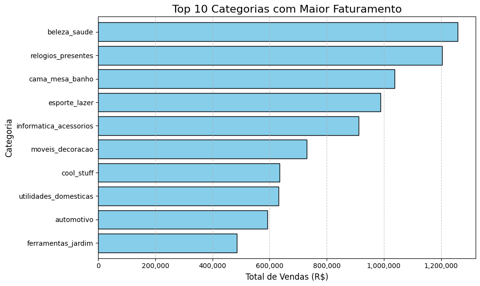

# Brazilian E-Commerce Data Visualization (Olist) 🇧🇷🛒

Este projeto apresenta uma análise exploratória visual completa do ecossistema de e-commerce da **Olist** (2016-2018), cobrindo dados reais de logística, finanças e catálogo de produtos no Brasil. 

O objetivo principal foi aplicar diferentes paradigmas de visualização da informação para extrair insights estratégicos sobre o comportamento de consumo e a malha comercial do país.

---

## 🚀 Tecnologias Utilizadas
* **Python** (Engine principal)
* **Pandas** & **NumPy** (Manipulação, limpeza e unificação de dados)
* **Matplotlib** (Gráficos estatísticos e temporais)
* **Plotly Express** (Visualizações geoespaciais e hierárquicas interativas)
* **NetworkX** (Modelagem de grafos e análise de redes)

---

## 📦 Como Configurar e Executar o Projeto

Como a base de dados consolidada excede os limites de upload padrão, você deve gerar o dataset unificado localmente seguindo os passos abaixo:

### 1. Clonar o Repositório

### 2. Instalar as Dependências

pip install pandas numpy matplotlib plotly networkx

### 3. Baixar os Dados Brutos
Acesse o dataset original no Kaggle: https://www.kaggle.com/datasets/olistbr/brazilian-ecommerce

Faça o download e extraia todos os arquivos .csv dentro da pasta raiz deste projeto.

### 4. Executar o Script de Unificação (Merge)
Execute o script Python merge.py para consolidar todas as tabelas no arquivo final esperado pelos scripts de visualização.

### 5. Executar os scripts
Execute os scripts main.ipynb na sequência para exibição dos gráficos.

---

📊 Estrutura das Visualizações
1. Estatística Descritiva (Top 10 Categorias)
Tipo: Gráfico de Barras Horizontais (Matplotlib)

Insight: Domínio das categorias de Beleza & Saúde (health_beauty) e Relógios (watches_gifts).

2. Informação Temporal (Evolução Mensal)
Tipo: Gráfico de Linha Contínua (Matplotlib)

Insight: Exibe o comportamento histórico de faturamento entre jan/2017 e ago/2018, evidenciando o pico sazonal da Black Friday em novembro de 2017.

3. Informação Geográfica (Densidade de Vendas)
Tipo: Mapa Choropleth (Plotly Express + GeoJSON)

Técnica: Aplicação de Escala Logarítmica para balancear o contraste visual da dominância econômica da região Sudeste.

4. Informação Hierárquica (Distribuição Regional)
Tipo: Treemap (Plotly Express)

Insight: Organiza proporcionalmente o faturamento dividindo por Estado do Cliente e suas respectivas categorias mais consumidas (Top 5 estados).

5. Visualização de Redes (Fluxo Comercial)
Tipo: Grafo Direcionado Node-Link (NetworkX + spring_layout)

Insight: Mapeia as 20 maiores rotas comerciais entre estados vendedores e compradores, consagrando São Paulo (SP) como o grande hub logístico nacional.
